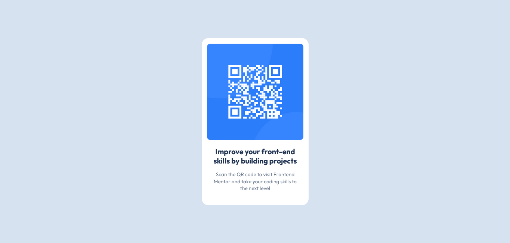

# Frontend Mentor - QR code component solution

This is a solution to the [QR code component challenge on Frontend Mentor](https://www.frontendmentor.io/challenges/qr-code-component-iux_sIO_H). Frontend Mentor challenges help you improve your coding skills by building realistic projects.

## Table of contents

-   [Overview](#overview)
    -   [Screenshot](#screenshot)
    -   [Links](#links)
-   [My process](#my-process)
    -   [Built with](#built-with)
    -   [What I learned](#what-i-learned)
    -   [Continued development](#continued-development)
-   [Author](#author)

## Overview

### Screenshot



### Links

-   [My solution in frontend mentor](https://www.frontendmentor.io/solutions/centered-qr-component-using-css-flexbox-PgadIIwYax)
-   [Live site on vercel](https://qr-code-component-front-end-mentor-six.vercel.app/)

## My process

### Built with

-   Semantic HTML5 markup
-   CSS custom properties
-   Flexbox

### What I learned

-Center a single element within a body

```css
body {
    display: flex;
    justify-content: center;
    align-items: center;
    height: 100vh;
}
```

### Continued development

I'm not really familiar with flexbox yet, I've already struggled a bit, centering the card in the middle of the page
So I'm looking forward to another project that will make use of flexbox and grid so that I can be more comfortable using them

## Author

-   Frontend Mentor - [@Joliot-TSIMISARAKA](https://www.frontendmentor.io/profile/Joliot-TSIMISARAKA)
-   Twitter - [@JoliotSitraka](https://x.com/JoliotSitraka)
